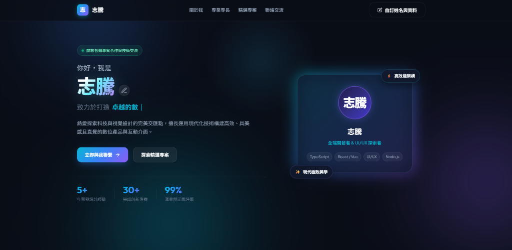

# AIoT-DA 課程實作報告：Class 1 (DIC-1)

## 專案名稱：個人專屬形象與作品集網站 (Personal Portfolio)

[](https://cg3599.github.io/20260916-hw/)
[](https://github.com/CG3599/20260916-hw)

---

## 📸 網站實體畫面 (Live View)

[](https://cg3599.github.io/20260916-hw/)

> 🌐 **線上體驗網址 (Live Demo)**：👉 [https://cg3599.github.io/20260916-hw/](https://cg3599.github.io/20260916-hw/)  
> *(點擊上方圖片或連結即可直接前往線上網站，體驗即時更名與微互動動效)*

---

## 📌 專案基本資訊

本專案為 **AIoT-DA** 課程第 1 單元（**DIC-1**）實作專題作業，聚焦於打造具備現代極致美學、設計系統規範（Design System Aesthetic）與純個人品牌導向（非天氣/氣象相關）的個人形象網站。

- 🌐 **線上展示 (Live Demo)**：[https://cg3599.github.io/20260916-hw/](https://cg3599.github.io/20260916-hw/)
- 💻 **GitHub 儲存庫**：[https://github.com/CG3599/20260916-hw](https://github.com/CG3599/20260916-hw)
- 📅 **實作日期**：2026-09-16
- 🏷️ **專案性質**：純個人品牌與作品集入口（Personal Portfolio & Profile）

---

## 🌟 線上展示頁內容完整介紹 (What's on the Live Page)

目前於線上展示頁中，完整包含以下 7 大核心區塊與互動體驗：

### 1. 頂部導航列 (Navigation Bar)
- **品牌 Logo 與 Monogram**：左側展示霓虹漸層徽章「志」與個人識別名稱「志騰」。
- **平滑錨點選單**：包含「關於我」、「專業專長」、「精選專案」、「聯絡交流」之快速滑動跳轉連結。
- **⏱️ 即時數位時鐘 (Real-time Clock)**：右側配置高質感毛玻璃時鐘膠囊，精準顯示本地即時時間（時:分:秒，Tabular Nums 無抖動平滑走時）與當前日期星期（如 `20:54:30 09/16 週三`），並搭配動態呼吸光點。
- **即時編輯按鈕**：右上角配置「**自訂姓名與資料**」快捷按鈕，隨時可開啟自訂彈窗。

---

### 2. 首頁核心形象展示區 (Hero Section)
- **狀態標籤 (Status Pill)**：動態綠色呼吸燈徽章，標註「`開放各類專案合作與技術交流`」。
- **姓名主標題 (Dynamic Hero Name)**：
  - 超大字體搭配霓虹漸層光感「**志騰**」。
  - 旁附有**即時編輯鉛筆圖示**，使用者直接點擊姓名即可迅速跳出編輯視窗進行改名。
- **動態打字機副標題 (Typewriter)**：
  - 動態循環輪播：「`致力於打造 卓越的數位體驗 / 現代全端應用系統 / 精緻直覺 UI/UX / 高效能雲端架構`」。
- **個人簡述 (Bio)**：「熱愛探索科技與視覺設計的完美交匯點，擅長運用現代化技術構建高效、具美感且直覺的數位產品與互動介面。」
- **雙主行動按鈕 (CTA)**：
  - 「**立即與我聯繫**」（霓虹漸層高光按鈕，點擊平滑滾動至聯絡區）。
  - 「**探索精選專案**」（毛玻璃質感按鈕，跳轉至專案區）。
- **關鍵成效指標 (Metric Stats)**：
  - **5+** 年開發設計經驗
  - **30+** 完成創新專案
  - **99%** 滿意與正面評價
- **⏱️ 即時數位時鐘卡片 (Real-Time Digital Clock Card)**：
  - **清晰大字體時間**：以 `3.8rem` 超大字體與等寬字元清晰呈現當前時間（例如：`21:05:30`），自帶微光青色陰影，隨每秒精準同步走時。
  - **完整年月日星期顯示**：以親切直覺的中文格式顯示日期（例如：`2026 年 9 月 16 日 星期三`）。
  - **個人身分徽章**：頂部整合「**志騰**」專屬紫色漸層頭像與職稱標註。
  - **系統狀態指示燈**：底部配置綠色狀態燈「系統時鐘即時同步運行中」，介面乾淨純粹、醒目直覺且載入零延遲。

---

### 3. 關於我與理念 (About Me)
以 3 欄毛玻璃質感卡片呈現個人開發與設計哲學：
1. 🚀 **技術理念**：堅持乾淨代碼與優質架構，注重流暢的用戶體驗與視覺細節。
2. 🎨 **美感與實用並重**：融合現代設計感、微動畫交互與直覺無障礙介面。
3. 💡 **持續演進與探索**：樂於擁抱 AI 輔助流程、尖端工程架構與新興工具。

---

### 4. 專業專長與核心技能 (Skills & Expertise)
將技術棧劃分為三大專業領域，並採用光澤反應膠囊標籤（Interactive Pills）：
- **💻 前端與互動開發**：JavaScript (ES6+)、TypeScript、HTML5 / Semantic Web、Modern CSS / SASS、React.js / Next.js、Vue.js / Vite、TailwindCSS、Web Animation。
- **⚙️ 後端與系統架構**：Node.js / Express、Python / FastAPI、RESTful & GraphQL API、PostgreSQL / MySQL、Redis 緩存、Docker 容器化、雲端部署。
- **🎯 產品設計與開發工具**：Figma UI/UX 原型設計、Git / GitHub 協作、CI/CD 自動化流程、效能優化 (Web Vitals)、響應式設計 (RWD)、AI 輔助工程流。

---

### 5. 精選專案作品 (Featured Projects)
展示 3 項具代表性的軟體與產品專案（均為軟體/設計專案，**無任何無關的天氣氣象項目**）：
1. ⚡ **智匯雲端協作工作台**：支援即時協同編輯、狀態同步與動態數據視覺化的專案管理平台。
2. 🧠 **AI 智慧知識助理與總結引擎**：整合 LLM API，實現智慧長文萃取、語音即時轉寫與多語系知識庫檢索。
3. 🎨 **Aura 現代玻璃質感組件庫**：內建 50+ 靈動毛玻璃微動效組件與深色系 Design Tokens 的 Web 組件庫。

---

### 6. 聯絡交流與互動功能 (Get in Touch)
- **一鍵複製信箱卡片**：展示 `zhiteng.dev@example.com`，點擊任一處或複製按鈕，即可自動複製到系統剪貼簿，並彈出優雅的綠色 Toast 通知。
- **官方社群與專案入口**：
  - [GitHub 專案儲存庫](https://github.com/CG3599/20260916-hw)
  - [Live Demo 線上展示頁](https://cg3599.github.io/20260916-hw/)
  - LinkedIn、Twitter / X、技術部落格

---

### 7. 內建動態與互動系統 (Interactive System)
- **即時數位時鐘引擎 (Real-time Clock Ticker)**：高精度每秒走時，自動格式化時、分、秒與日期星期，支援響應式動態收合。
- **即時個人資料自訂彈窗 (Profile Customizer Modal)**：
  - 使用者在瀏覽器中點擊姓名或按鈕，即可開啟編輯彈窗，自訂姓名、職稱、Email、自述簡介。
  - 儲存後**全站即時更新**，並自動持久化保存至瀏覽器 `LocalStorage`，重新整理也不會消失。
- **滑鼠游標光暈追蹤 (Cursor Glow)**：滑鼠移動時會有柔和的光暈跟隨，強化暗色系的沉浸式微光氛圍。
- **環境動態光球 (Ambient Glow Orbs)**：背景配置緩慢飄動的三原色柔光球，營造前沿科技視覺深度。
- **全響應式設計 (Fully Responsive)**：在手機、平板、筆電與寬螢幕桌機皆維持最佳排版。

---

## 📁 專案檔案結構

```text
20260916/
├── assets/
│   └── live-preview.png  # 網站實際畫面截圖 (Live View)
├── index.html            # 語義化 HTML5 骨幹（各區塊、形象卡片、自訂彈窗與 Toast）
├── style.css             # 現代 CSS 設計系統、深色毛玻璃、光暈動效、排版與響應式斷點
├── script.js             # 原生 JavaScript 互動邏輯（打字機、游標光暈、LocalStorage 持久化、一鍵複製）
├── README.md             # 專案與線上展示內容完整說明文件（含 Live View 截圖與連結）
└── .gitignore            # Git 版本控制忽略設定檔
```
